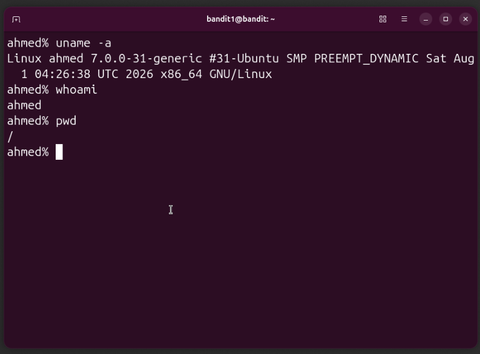

# Linux Environment Setup

## Objective

Set up a Linux environment that I can use throughout my DevOps learning journey.

## Environment

I installed Linux natively on my Mac rather than using WSL, a cloud VM, or a virtual machine.

The purpose of this environment is to have a dedicated Linux system where I can practice:

* Linux administration
* Bash
* Git
* Networking
* Docker
* Troubleshooting
* DevOps tooling

## Installation

Linux was installed natively on my Mac.

After completing the installation, I opened the terminal and verified that the system was working correctly.

## Verification

I used the following commands:

```bash
uname -a
whoami
pwd
```


```bash
uname -a
Linux ahmed 7.0.0-31-generic #31-Ubuntu SMP PREEMPT_DYNAMIC Sat Aug  1 04:26:38 UTC 2026 x86_64 GNU/Linux


```bash
whoami
ahmed


```bash
pwd
/ 

This displays the absolute path of my current working directory.

## Result
The commands executed successfully, confirming that the Linux environment was ready for use.

## Next Steps
With the environment set up, I can now begin working through Linux fundamentals and hands-on challenges.

The next areas I will focus on are:

* Filesystem navigation
* Files and directories
* File permissions
* Users and groups
* Processes
* Networking
* SSH
* Bash
* Troubleshooting
* Bandit
* SadServers


## Screenshot

The screenshot below shows the verification commands and their output after completing the Linux environment setup.


